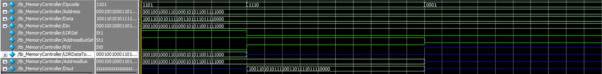

# verilog-cpu

- Design of simple ALU
- Design of register banks along with decoding and multiplexing circuits
- Design of memory access block along with its multiplexing (used to complete the execution of the LDR and STR instructions)
- Design of the RAM

## Memory Controller

| Input   | Bits | Description      |
| ------- | ---- | ---------------- |
| Opcode  | 4    | Opcode           |
| Address | 32   | Source1          |
| Data    | 32   | Source2          |
| Din     | 32   | Data from memory |

| Output           | Bits | Description                                |
| ---------------- | ---- | ------------------------------------------ |
| LDRSel           | 1    | For LDR MUX                                |
| AddressBusSel    | 1    | For Address Bus MUX                        |
| RW               | 1    | For memory access, RW=0: read, RW=1: write |
| LDRDataToDestReg | 32   | For LDR MUX                                |
| AddressBus       | 32   | For memory access                          |
| Dout             | 32   | For memory access                          |

### Simulation

## RAM
| Input      | Bits | Description                                |
| ---------- | ---- | ------------------------------------------ |
| address    | 16   | Address bus                                |
| data_input | 32   | Data input                                 |
| RW         | 1    | For memory access, RW=0: read, RW=1: write |

| Output      | Bits | Description |
| ----------- | ---- | ----------- |
| data_output | 1    | data output |

### Simulation

### For test
